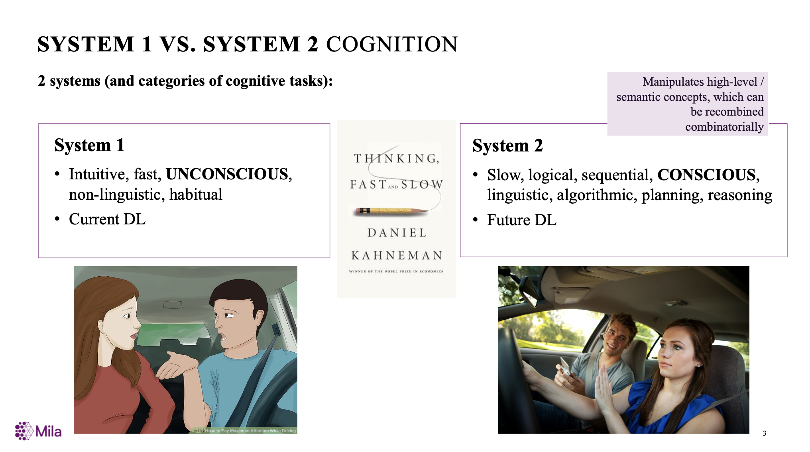
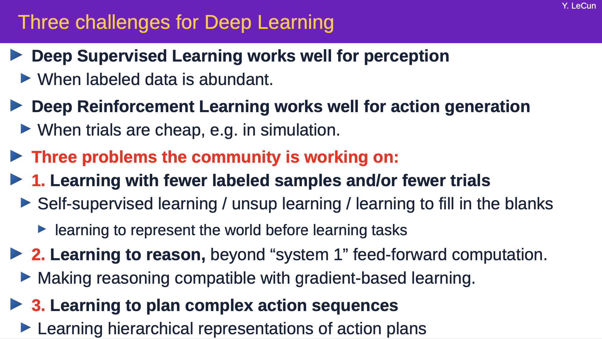

# Deep-Reasoning-Papers
Recent Papers including Neural Symbolic Reasoning, Logical Reasoning, Visual Reasoning, natural language reasoning and any other topics connecting deep learning and reasoning.

## 0 Survey or Talk

**[1]** Yoshua Bengio,**From System 1 Deep Learning to System 2 Deep Learning** [[pdf]](https://drive.google.com/file/d/1zbe_N8TmAEvPiKXmn6yZlRkFehsAUS8Z/view) [[video]](https://youtu.be/T3sxeTgT4qc)

**[2]** Yann Lecun, **Self-Supervised Learning** [[pdf]](https://drive.google.com/file/d/1r-mDL4IX_hzZLDBKp8_e8VZqD7fOzBkF/view)

**[3]** Petar Veličković **Graph Representation Learning for Algorithmic Reasoning** [[pdf]](https://petar-v.com/talks/Algo-WWW.pdf)

## 1 Mathematical Problems

**[1]** Saxton, David, et al. **Analysing mathematical reasoning abilities of neural models.** arXiv preprint arXiv:1904.01557 (2019).[[pdf]](https://arxiv.org/pdf/1904.01557)

**[2]** Ortega, Pedro A., et al. **Meta-learning of sequential strategies.** arXiv preprint arXiv:1905.03030 (2019).[[pdf]](https://arxiv.org/pdf/1905.03030)

**[3]** Lample, Guillaume, and François Charton. **Deep learning for symbolic mathematics.** arXiv preprint arXiv:1912.01412 (2019).[[pdf]](https://arxiv.org/pdf/1912.01412)

**[4]** Zhuo, Tao, and Mohan Kankanhalli. **Solving Raven's Progressive Matrices with Neural Networks.** arXiv preprint arXiv:2002.01646 (2020).[[pdf]](https://arxiv.org/pdf/2002.01646)

**[5]** Zheng, Kecheng, Zheng-Jun Zha, and Wei Wei. **Abstract Reasoning with Distracting Features.** Advances in Neural Information Processing Systems. 2019. [[pdf]](http://papers.nips.cc/paper/8819-abstract-reasoning-with-distracting-features.pdf)

**[6]** van Steenkiste, Sjoerd, et al. **Are Disentangled Representations Helpful for Abstract Visual Reasoning?.** Advances in Neural Information Processing Systems. 2019. [[pdf]](https://papers.nips.cc/paper/9570-are-disentangled-representations-helpful-for-abstract-visual-reasoning.pdf)

**[7]** Dong, Honghua, et al. **Neural logic machines.** arXiv preprint arXiv:1904.11694 (2019). [[pdf]](https://arxiv.org/pdf/1904.11694)

**[8]** Zhang, Chi, et al. **Learning perceptual inference by contrasting.** Advances in Neural Information Processing Systems. 2019.[[pdf]](http://papers.nips.cc/paper/8392-learning-perceptual-inference-by-contrasting.pdf)

**[9]** Santoro, Adam, et al. **Measuring abstract reasoning in neural networks.** International Conference on Machine Learning. 2018.[[pdf]](http://proceedings.mlr.press/v80/santoro18a/santoro18a.pdf)

**[10]** Wang, Po-Wei, et al. **SATNet: Bridging deep learning and logical reasoning using a differentiable satisfiability solver.** arXiv preprint arXiv:1905.12149 (2019).

**[11]** Manhaeve, Robin, et al. **Deepproblog: Neural probabilistic logic programming.** Advances in Neural Information Processing Systems. 2018.[[pdf]](http://papers.nips.cc/paper/7632-deepproblog-neural-probabilistic-logic-programming.pdf)

**[13]** van Steenkiste, Sjoerd, et al. **Are Disentangled Representations Helpful for Abstract Visual Reasoning?.** Advances in Neural Information Processing Systems. 2019. [[pdf]](https://papers.nips.cc/paper/9570-are-disentangled-representations-helpful-for-abstract-visual-reasoning.pdf)

**[14]** Dai, Wang-Zhou, et al. **Bridging machine learning and logical reasoning by abductive learning.** Advances in Neural Information Processing Systems. 2019. [[pdf]](http://papers.nips.cc/paper/8548-bridging-machine-learning-and-logical-reasoning-by-abductive-learning.pdf) [[code]](https://github.com/AbductiveLearning/ABL-HED)

## 2 Raven's Progressive Matrices

**[1]** Santoro, Adam, et al. **Measuring abstract reasoning in neural networks.** International Conference on Machine Learning. 2018.[[pdf]](http://proceedings.mlr.press/v80/santoro18a/santoro18a.pdf)

**[2]** Zhang, Chi, et al. **Raven: A dataset for relational and analogical visual reasoning.** Proceedings of the IEEE Conference on Computer Vision and Pattern Recognition. 2019.[[pdf]](http://openaccess.thecvf.com/content_CVPR_2019/papers/Zhang_RAVEN_A_Dataset_for_Relational_and_Analogical_Visual_REasoNing_CVPR_2019_paper.pdf)

**[3]** Zheng, Kecheng, Zheng-Jun Zha, and Wei Wei. **Abstract Reasoning with Distracting Features.** Advances in Neural Information Processing Systems. 2019.[[pdf]](http://papers.nips.cc/paper/8819-abstract-reasoning-with-distracting-features.pdf)

**[4]** Hill, Felix, et al. "Learning to make analogies by contrasting abstract relational structure." arXiv preprint arXiv:1902.00120 (2019).[[pdf]](https://arxiv.org/pdf/1902.00120)

**[5]** Hu, Sheng, et al. **Hierarchical Rule Induction Network for Abstract Visual Reasoning.** arXiv preprint arXiv:2002.06838 (2020). [[pdf]](https://arxiv.org/pdf/2002.06838)

**[6]** Zhang, Chi, et al. **Learning perceptual inference by contrasting." Advances in Neural Information Processing Systems**. 2019. [[pdf]](http://papers.nips.cc/paper/8392-learning-perceptual-inference-by-contrasting.pdf)

**[7]** van Steenkiste, Sjoerd, et al. **Are Disentangled Representations Helpful for Abstract Visual Reasoning?.** Advances in Neural Information Processing Systems. 2019.[[pdf]](https://papers.nips.cc/paper/9570-are-disentangled-representations-helpful-for-abstract-visual-reasoning.pdf)

**[8]** Zhuo, Tao, and Mohan Kankanhalli. **Solving Raven's Progressive Matrices with Neural Networks.** arXiv preprint arXiv:2002.01646 (2020). [[pdf]](https://arxiv.org/pdf/2002.01646)

**[9]** Wang, Duo, Mateja Jamnik, and Pietro Lio. **Abstract diagrammatic reasoning with multiplex graph networks.** (2020). [[pdf]](https://openreview.net/pdf?id=ByxQB1BKwH)

**[10]** Steenbrugge, Xander, et al. **Improving generalization for abstract reasoning tasks using disentangled feature representations.** arXiv preprint arXiv:1811.04784 (2018). [[pdf]](https://arxiv.org/pdf/1811.04784)

## 3 Visual Reasoning

**[1]** Han, Chi, et al. **Visual Concept-Metaconcept Learning.** Advances in Neural Information Processing Systems. 2019. [[pdf]](https://papers.nips.cc/paper/8745-visual-concept-metaconcept-learning.pdf)

**[2]** Mao, Jiayuan, et al. **Program-Guided Image Manipulators.** Proceedings of the IEEE International Conference on Computer Vision. 2019.[[pdf]](http://openaccess.thecvf.com/content_ICCV_2019/papers/Mao_Program-Guided_Image_Manipulators_ICCV_2019_paper.pdf)

**[3]** Mao, Jiayuan, et al. **The neuro-symbolic concept learner: Interpreting scenes, words, and sentences from natural supervision.** arXiv preprint arXiv:1904.12584 (2019). [[pdf]](https://arxiv.org/pdf/1904.12584)

**[4]** Tian, Yonglong, et al. **Learning to infer and execute 3d shape programs.** arXiv preprint arXiv:1901.02875 (2019). [[pdf]](https://arxiv.org/pdf/1901.02875)

**[5]** Liu, Yunchao, et al. **Learning to describe scenes with programs.** (2018). [[pdf]](https://openreview.net/pdf?id=SyNPk2R9K7)

**[6]** Yi, Kexin, et al. **Neural-symbolic vqa: Disentangling reasoning from vision and language understanding.** Advances in Neural Information Processing Systems. 2018. [[pdf]](https://papers.nips.cc/paper/7381-neural-symbolic-vqa-disentangling-reasoning-from-vision-and-language-understanding.pdf)

## 4 Physical Reasoning/Planning/Model based/World Model

**[1]** Jaques, Miguel, Michael Burke, and Timothy Hospedales. **Physics-as-inverse-graphics: Joint unsupervised learning of objects and physics from video.** arXiv preprint arXiv:1905.11169 (2019). [[pdf]](https://openreview.net/pdf?id=BJeKwTNFvB)

**[2]** Bakhtin, Anton, et al. **Phyre: A new benchmark for physical reasoning.** Advances in Neural Information Processing Systems. 2019. [[pdf]](https://papers.nips.cc/paper/8752-phyre-a-new-benchmark-for-physical-reasoning.pdf)

**[3]** Ye Y, Gandhi D, Gupta A, et al. **Object-centric Forward Modeling for Model Predictive Control**[J]. arXiv preprint arXiv:1910.03568, 2019. [[pdf]](https://arxiv.org/pdf/1910.03568)

**[4]** Veerapaneni R, Co-Reyes J D, Chang M, et al. **Entity Abstraction in Visual Model-Based Reinforcement Learning**[J]. arXiv preprint arXiv:1910.12827, 2019.[[pdf]](https://arxiv.org/pdf/1910.12827)

**[5]** Janner M, Levine S, Freeman W T, et al. **Reasoning about physical interactions with object-oriented prediction and planning**[J]. arXiv preprint arXiv:1812.10972, 2018.[[pdf]](https://arxiv.org/pdf/1812.10972)

**[6]** Kossen J, Stelzner K, Hussing M, et al. **Structured Object-Aware Physics Prediction for Video Modeling and Planning**[J]. arXiv preprint arXiv:1910.02425, 2019. [[pdf]](https://arxiv.org/pdf/1910.02425)

**[7]** Watters N, Matthey L, Bosnjak M, et al. **Cobra: Data-efficient model-based rl through unsupervised object discovery and curiosity-driven exploration**[J]. arXiv preprint arXiv:1905.09275, 2019.[[pdf]](https://arxiv.org/pdf/1905.09275)

**[8]** Li Y, He H, Wu J, et al. **Learning Compositional Koopman Operators for Model-Based Control**[J]. arXiv preprint arXiv:1910.08264, 2019.[[pdf]](https://arxiv.org/pdf/1910.08264)

**[9]** Kulkarni T D, Gupta A, Ionescu C, et al. **Unsupervised learning of object keypoints for perception and control**[C]//Advances in Neural Information Processing Systems. 2019: 10723-10733. [[pdf]](http://papers.nips.cc/paper/9256-unsupervised-learning-of-object-keypoints-for-perception-and-control.pdf)

**[10]** Kipf T, van der Pol E, Welling M. **Contrastive Learning of Structured World Models**[J]. arXiv preprint arXiv:1911.12247, 2019. [[pdf]](https://arxiv.org/pdf/1911.12247)

**[11]** Chang M B, Ullman T, Torralba A, et al. **A compositional object-based approach to learning physical dynamics**[J]. arXiv preprint arXiv:1612.00341, 2016. [[pdf]](https://arxiv.org/pdf/1612.00341)

**[12]** Sanchez-Gonzalez A, Godwin J, Pfaff T, et al. **Learning to Simulate Complex Physics with Graph Networks**[J]. arXiv preprint arXiv:2002.09405, 2020.[[pdf]](https://arxiv.org/pdf/2002.09405)

**[13]** Battaglia P, Pascanu R, Lai M, et al. **Interaction networks for learning about objects, relations and physics**[C]//Advances in neural information processing systems. 2016: 4502-4510. [[pdf]](http://papers.nips.cc/paper/6418-interaction-networks-for-learning-about-objects-relations-and-physics.pdf)

**[14]** Watters N, Zoran D, Weber T, et al. **Visual interaction networks: Learning a physics simulator from video**[C]//Advances in neural information processing systems. 2017: 4539-4547. [[pdf]](http://papers.nips.cc/paper/7040-visual-interaction-networks-learning-a-physics-simulator-from-video.pdf)

**[15]** Cranmer M, Greydanus S, Hoyer S, et al. **Lagrangian Neural Networks**[J]. arXiv preprint arXiv:2003.04630, 2020. [[pdf]](https://arxiv.org/pdf/2003.04630)

**[16]** Sanchez-Gonzalez A, Heess N, Springenberg J T, et al. **Graph networks as learnable physics engines for inference and control**[J]. arXiv preprint arXiv:1806.01242, 2018. [[pdf]](https://arxiv.org/pdf/1806.01242)

**[17]** Li Y, Wu J, Tedrake R, et al. **Learning particle dynamics for manipulating rigid bodies, deformable objects, and fluids**[J]. arXiv preprint arXiv:1810.01566, 2018.[[pdf]](https://arxiv.org/pdf/1810.01566)

## 5 Natural Language Reasoning

**[1]** Schlag, Imanol, and Jürgen Schmidhuber. **Learning to reason with third order tensor products.** Advances in neural information processing systems. 2018.[[pdf]](http://papers.nips.cc/paper/8203-learning-to-reason-with-third-order-tensor-products.pdf)

## 6 Modularity/Compositional or Systematic Generalization

**[1]** Jacobs R A, Jordan M I, Nowlan S J, et al. **Adaptive mixtures of local experts[J]. Neural computation**, 1991, 3(1): 79-87. [[pdf]](http://www.csri.utoronto.ca/~hinton/absps/jjnh91.ps)

**[2]** Bottou L, Gallinari P. **A framework for the cooperation of learning algorithms**[C]//Advances in neural information processing systems. 1991: 781-788. [[pdf]](http://papers.nips.cc/paper/308-a-framework-for-the-cooperation-of-learning-algorithms.pdf)

**[3]** Ronco E, Gollee H, Gawthrop P J. **Modular neural network and self-decomposition**[J]. Connection Science (special issue: COMBINING NEURAL NETS).(To appear), 1996. [[pdf]](http://citeseerx.ist.psu.edu/viewdoc/download?doi=10.1.1.42.3570&rep=rep1&type=pdf)

**[4]** Reed S, De Freitas N. **Neural programmer-interpreters**[J]. arXiv preprint arXiv:1511.06279, 2015.
[[pdf]](https://arxiv.org/pdf/1511.06279)

**[5]** Andreas J, Rohrbach M, Darrell T, et al. **Neural module networks**[C]//Proceedings of the IEEE Conference on Computer Vision and Pattern Recognition. 2016: 39-48. [[pdf]](http://openaccess.thecvf.com/content_cvpr_2016/papers/Andreas_Neural_Module_Networks_CVPR_2016_paper.pdf)

**[6]** Parascandolo G, Kilbertus N, Rojas-Carulla M, et al. **Learning independent causal mechanisms**[J]. arXiv preprint arXiv:1712.00961, 2017. [[pdf]](https://arxiv.org/pdf/1712.00961)

**[7]** Rosenbaum C, Klinger T, Riemer M. **Routing networks: Adaptive selection of non-linear functions for multi-task learning**[J]. arXiv preprint arXiv:1711.01239, 2017. [[pdf]](https://arxiv.org/pdf/1711.01239)

**[8]** Fernando C, Banarse D, Blundell C, et al. **Pathnet: Evolution channels gradient descent in super neural networks**[J]. arXiv preprint arXiv:1701.08734, 2017. [[pdf]](https://arxiv.org/pdf/1701.08734)

**[9]** Shazeer N, Mirhoseini A, Maziarz K, et al. **Outrageously large neural networks: The sparsely-gated mixture-of-experts layer**[J]. arXiv preprint arXiv:1701.06538, 2017. [[pdf]](https://arxiv.org/pdf/1701.06538.pdf%22%20%5Ct%20%22_blank)

**[10]** Kirsch L, Kunze J, Barber D. **Modular networks: Learning to decompose neural computation**[C]//Advances in Neural Information Processing Systems. 2018: 2408-2418. [[pdf]](http://papers.nips.cc/paper/7508-modular-networks-learning-to-decompose-neural-computation.pdf)

**[11]** Rosenbaum C, Cases I, Riemer M, et al. **Routing networks and the challenges of modular and compositional computation**[J]. arXiv preprint arXiv:1904.12774, 2019. [[pdf]](https://arxiv.org/pdf/1904.12774)

**[12]** Goyal A, Lamb A, Hoffmann J, et al. **Recurrent independent mechanisms**[J]. arXiv preprint arXiv:1909.10893, 2019. [[pdf]](https://arxiv.org/pdf/1909.10893)

**[13]** Goyal A, Sodhani S, Binas J, et al. **Reinforcement Learning with Competitive Ensembles of Information-Constrained Primitives**[J]. arXiv preprint arXiv:1906.10667, 2019. [[pdf]](https://arxiv.org/pdf/1906.10667)

**[14]** Yang R, Xu H, Wu Y, et al. **Multi-Task Reinforcement Learning with Soft Modularization**[J]. arXiv preprint arXiv:2003.13661, 2020. [[pdf]](https://arxiv.org/pdf/2003.13661)

**[15]** Peng X B, Chang M, Zhang G, et al. **Mcp: Learning composable hierarchical control with multiplicative compositional policies**[C]//Advances in Neural Information Processing Systems. 2019: 3681-3692. [[pdf]](https://xbpeng.github.io/projects/MCP/2019_MCP.pdf)

**[16]** Hu, Ronghang, et al. **Learning to reason: End-to-end module networks for visual question answering.** Proceedings of the IEEE International Conference on Computer Vision. 2017. [[pdf]](http://openaccess.thecvf.com/content_ICCV_2017/papers/Hu_Learning_to_Reason_ICCV_2017_paper.pdf)

**[17]** Devin, Coline, et al. **Learning modular neural network policies for multi-task and multi-robot transfer.** 2017 IEEE International Conference on Robotics and Automation (ICRA). IEEE, 2017. [[pdf]](https://arxiv.org/pdf/1609.07088)

**[18]** Alet, Ferran, Tomás Lozano-Pérez, and Leslie P. Kaelbling. **Modular meta-learning.** arXiv preprint arXiv:1806.10166 (2018). [[pdf]](https://arxiv.org/pdf/1806.10166)

**[19]** Chitnis, Rohan, Leslie Pack Kaelbling, and Tomás Lozano-Pérez. **Learning quickly to plan quickly using modular meta-learning.** 2019 International Conference on Robotics and Automation (ICRA). IEEE, 2019.[[pdf]](https://arxiv.org/pdf/1809.07878)

**[20]** Alet, Ferran, et al. **Modular meta-learning in abstract graph networks for combinatorial generalization.** arXiv preprint arXiv:1812.07768 (2018).[[pdf]](https://arxiv.org/pdf/1812.07768)

**[21]** Chen, Yutian, et al. **Modular meta-learning with shrinkage** arXiv preprint arXiv:1909.05557 (2019). [[pdf]](https://arxiv.org/pdf/1909.05557)

**[22]** Alet, Ferran, et al. **Neural Relational Inference with Fast Modular Meta-learning.** Advances in Neural Information Processing Systems. 2019. [[pdf]](https://papers.nips.cc/paper/9353-neural-relational-inference-with-fast-modular-meta-learning.pdf)

**[23]** Andreas, Jacob, Dan Klein, and Sergey Levine. **Modular multitask reinforcement learning with policy sketches.** Proceedings of the 34th International Conference on Machine Learning-Volume 70. JMLR. org, 2017. [[pdf]](https://dl.acm.org/ft_gateway.cfm?id=3305399&type=pdf)

## Datasets

**[1]** Johnson, Justin, et al. **Clevr: A diagnostic dataset for compositional language and elementary visual reasoning.** Proceedings of the IEEE Conference on Computer Vision and Pattern Recognition. 2017. [[pdf]](http://openaccess.thecvf.com/content_cvpr_2017/papers/Johnson_CLEVR_A_Diagnostic_CVPR_2017_paper.pdf)

**[2]** Zellers, Rowan, et al. **From recognition to cognition: Visual commonsense reasoning.** Proceedings of the IEEE Conference on Computer Vision and Pattern Recognition. 2019.[[pdf]](https://arxiv.org/pdf/1811.10830)

**[3]** Zhang, Wenhe, et al. **Machine Number Sense: A Dataset of Visual Arithmetic Problems for Abstract and Relational Reasoning.** Pythagoras 100.300 (1818).[[pdf]](http://www.stat.ucla.edu/~sczhu/papers/Conf_2020/AAAI2020_Machine_Number_Sense.pdf)

**[4]** Santoro, Adam, et al. **Measuring abstract reasoning in neural networks.** International Conference on Machine Learning. 2018.[[pdf]](http://proceedings.mlr.press/v80/santoro18a/santoro18a.pdf)

**[5]** Zhang, Chi, et al. **Raven: A dataset for relational and analogical visual reasoning.** Proceedings of the IEEE Conference on Computer Vision and Pattern Recognition. 2019.[[pdf]](http://openaccess.thecvf.com/content_CVPR_2019/papers/Zhang_RAVEN_A_Dataset_for_Relational_and_Analogical_Visual_REasoNing_CVPR_2019_paper.pdf)

**[6]** Bakhtin, Anton, et al. **Phyre: A new benchmark for physical reasoning.** Advances in Neural Information Processing Systems. 2019. [[pdf]](https://papers.nips.cc/paper/8752-phyre-a-new-benchmark-for-physical-reasoning.pdf)

**[7]** Baradel, Fabien, et al. **COPHY: Counterfactual Learning of Physical Dynamics.** arXiv preprint arXiv:1909.12000 (2019). [[pdf]](https://arxiv.org/pdf/1909.12000)

